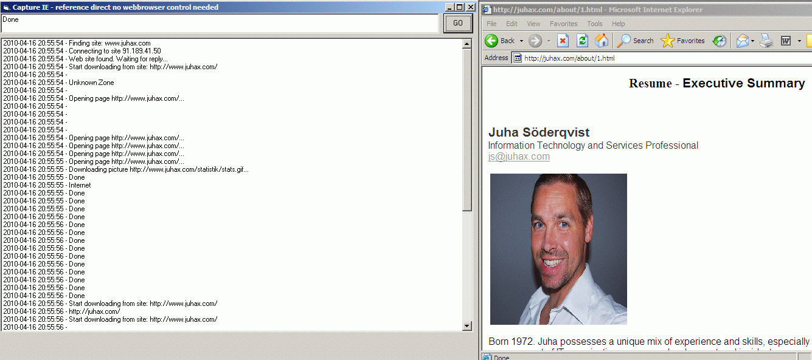



## Capture IE and events no webbrowser control needed

### Description

Capture IE and events. Direct reference to IE, now webbrowser control needed. Track events in listbox, could be used for performance testing etc.
 
### More Info
 

             |
---                |---
**Submitted On**   |2010-04-16 15:10:02
**By**             |[Juha s�derqvist](https://github.com/Planet-Source-Code/PSCIndex/blob/master/ByAuthor/juha-s-derqvist.md)
**Level**          |Advanced
**User Rating**    |5.0 (10 globes from 2 users)
**Compatibility**  |VB 6\.0
**Category**       |[Internet/ HTML](https://github.com/Planet-Source-Code/PSCIndex/blob/master/ByCategory/internet-html__1-34.md)
**World**          |[Visual Basic](https://github.com/Planet-Source-Code/PSCIndex/blob/master/ByWorld/visual-basic.md)
**Archive File**   |[Capture\_IE2179094162010\.zip](https://github.com/Planet-Source-Code/juha-s-derqvist-capture-ie-and-events-no-webbrowser-control-needed__1-73073/archive/master.zip)

